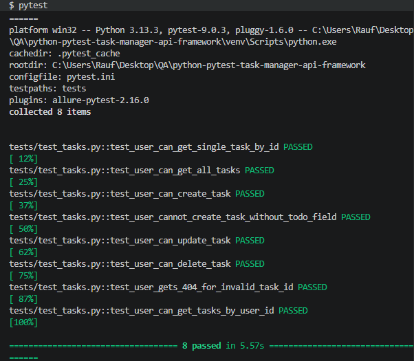
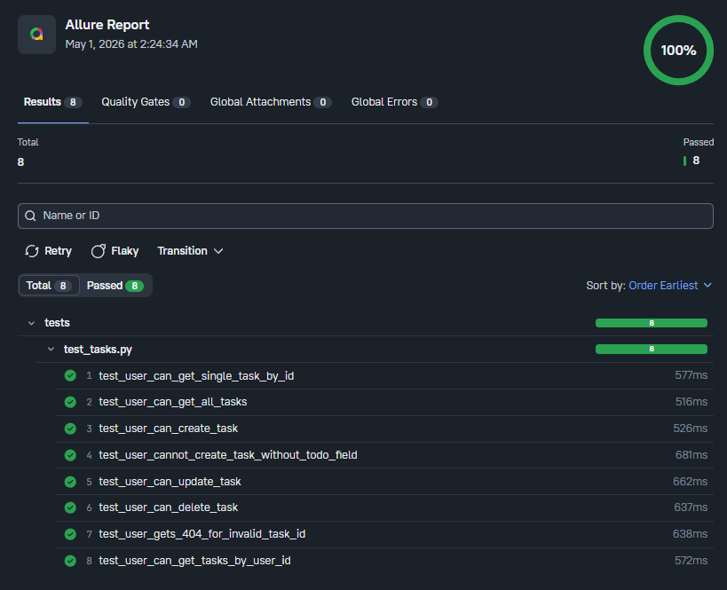

# Python Pytest Task Manager API Automation Framework

## Project Overview

This project is an API automation testing framework built with **Python**, **Pytest**, and the **Requests** library.

It tests a public task-management style API using realistic CRUD scenarios and negative validations.

The framework was created as a portfolio project to demonstrate practical **Automation QA** skills in API testing.

It includes:
- reusable API routes
- reusable request payloads
- a reusable API client
- positive and negative test coverage
- Allure reporting integration

---

## API Under Test

**DummyJSON Todos API**  
https://dummyjson.com/docs/todos

This public mock API was used to simulate a task manager backend for portfolio practice.

**Important note:**  
This API is a mock API. Some create, update, and delete operations are simulated and may not permanently persist changes on the server.

---

## Tools and Technologies

- Python
- Pytest
- Requests
- Allure Reports
- Git and GitHub

---

## Key Features

- CRUD API automation coverage
- Positive and negative test scenarios
- Reusable API routes stored separately
- Reusable request payloads stored separately
- Reusable API client for request handling
- Clean and readable test design
- Allure report support

---

## Project Structure

    tests/
    data/
    utils/
    screenshots/
    README.md
    requirements.txt
    pytest.ini

---

## Covered Test Scenarios

### Read
- Verify that a single task can be retrieved by valid task ID
- Verify that the full task list can be retrieved
- Verify that tasks can be retrieved for a specific user

### Create
- Verify that a new task can be created successfully
- Verify API behavior when required task field is missing

### Update
- Verify that an existing task can be updated

### Delete
- Verify that an existing task can be deleted

### Negative Testing
- Verify that requesting a non-existing task returns 404

---

## Framework Design

### utils/api_routes.py
Stores reusable API endpoints and base URL.

### utils/api_client.py
Stores reusable request methods:
- GET
- POST
- PUT
- DELETE

### data/task_data.py
Stores reusable request payloads and test values.

### tests/test_tasks.py
Stores the main API test scenarios.

This structure keeps test logic separate from configuration and request handling, making the framework easier to maintain and explain in interviews.

---

## Installation Steps

### 1. Clone the repository

    git clone https://github.com/raufnajiyev/python-pytest-task-manager-api-framework.git

### 2. Open the project folder

    cd python-pytest-task-manager-api-framework

### 3. Create a virtual environment

    python -m venv venv

### 4. Activate the virtual environment

**Git Bash**

    source venv/Scripts/activate

**Command Prompt**

    venv\Scripts\activate

**PowerShell**

    .\venv\Scripts\Activate.ps1

### 5. Install dependencies

    pip install -r requirements.txt

---

## How to Run Tests

Run all tests:

    pytest

---

## How to Run Tests with Allure Results

Run tests and save Allure result files:

    pytest --alluredir=allure-results

---

## How to Open Allure Report

Open the Allure report in browser:

    allure serve allure-results

---

## Screenshots

### Pytest Test Run

### Allure Report Overview

---

## Why This Project Is Important

This project demonstrates:
- API automation with Python
- request and response validation
- CRUD testing
- positive and negative scenario coverage
- reusable framework structure
- reporting with Allure

It was built to help demonstrate practical API testing skills for QA Engineer and Automation QA Engineer roles.

---

## Author

**Rauf Najiyev**